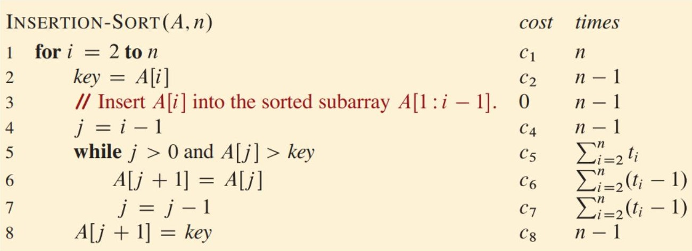

# Analyzing Algorithms

## What is Analyzing Algorithms ?

 - Analyzing an algorithm has come to mean predicting the resources that the algorithm requires.

 - You might consider resources such as memory, communication bandwidth, or energy consumption.

 - You’ll want to measure computational time too.

 -  If you analyze several candidate algorithms for a problem, you can identify the most efficient one.

---
## What is  random-access machine (RAM) model !! and why ? 
 
 - Before you can analyze an algorithm, you need a model of the technology that it runs on, including the resources of that technology and a way to express their
costs.
 - Most of this book assumes a generic one-processor, random-access machine **(RAM)** model of computation as the implementation technology, with the
understanding that algorithms are implemented as computer programs.

---
## How RAM model works ? 
 
 - In the RAM model, instructions execute one after another, with no concurrent operations.
 
 - The RAM model assumes that each instruction takes the same amount of time as any other instruction and that each data access using the value of a variable or storing into a variable takes the same amount of time as any other data access.
 
 - In other words, in the RAM model each instruction or data access takes a constant amount of time even indexing into an array.

 - We assume that each element of a given array occupies the same number of bytes and that the elements of a given array are stored in contiguous memory locations. 
 
### For example, of array $A[1:n]$ 

 - Starts at memory address 1000 and each element occupies **four bytes**, then element $A[i]$ is at address $1000 + 4(i-1)$ .
 
 -  In general, computing the address in memory of a particular array element requires at most one subtraction (no subtraction for a 0-origin array), one multiplication (often implemented as a shift operation if the element size is an exact power of 2), and one addition.

 - Furthermore, for code that iterates through the elements of an array in order, an optimizing compiler can generate the address of each element using just one addition, by adding the element size to the address of the preceding element.

---

## How real computers are designed. The RAM model ?
 
- **Arithmetic** (such as add, subtract, multiply, divide, remainder, floor, ceiling), 

- **Data movement** (load, store, copy).

- **Control** (conditional and unconditional branch, subroutine call and return).

---

## Limitations of the RAM Model

 The RAM model is a widely used theoretical model for analyzing the time and space complexity of algorithms. However, it has several limitations that should be considered:

 1. **Memory Hierarchy Neglect**: The RAM model does not account for the memory hierarchy common in contemporary computers, which includes caches and virtual memory. This can lead to discrepancies between the theoretical analysis and the actual performance on real-world hardware.

 2. **Cache and Virtual Memory Abstraction**: The RAM model abstracts away the details of caching and virtual memory, which can have a significant impact on the performance of algorithms, especially those with irregular memory access patterns.

 3. **Predictive Capability**: Despite these limitations, RAM-model analyses are often excellent predictors of performance on actual machines. The simplicity of the model and the insights it provides make it a valuable tool for algorithm analysis and design.

 4. **Analytical Challenge**: Although the RAM model is often straightforward to use, analyzing some algorithms in this model can be quite challenging. Certain algorithmic techniques, such as dynamic programming or amortized analysis, can require more complex reasoning within the RAM model framework.

It is important to keep these limitations in mind when applying the RAM model to analyze algorithms. In some cases, more sophisticated models, such as the **cache-aware** or **cache-oblivious** models, may be necessary to capture the nuances of real-world hardware and memory architectures.

By understanding the strengths and weaknesses of the RAM model, researchers and practitioners can better interpret the results of algorithm analyses and make informed decisions about the practical implementation and performance of their algorithms.

---

## Analysis of insertion sort

 - We can determine how long it takes by analyzing the algorithm itself. 
 
 - We’ll examine how many times it executes each line of pseudocode and how long each line of pseudocode takes to run.
 
 - We’ll first come up with a precise but complicated formula for the running time.
 
 - Then, we’ll distill the important part of the formula using a convenient notation that can help us compare the running times of different algorithms for the same problem.

### How do we analyze insertion sort?

 -  First, let’s acknowledge that the running time depends on the input.

 -  You shouldn’t be terribly surprised that sorting a thousand numbers takes longer than sorting three numbers.

 - Moreover, insertion sort can take different amounts of time to sort two input arrays of the same size, depending on how nearly sorted they already are.

 - Even though the running time can depend on many features of the input, we’ll focus on the one that has been shown to have the greatest effect, namely the size of the input, and describe the running time of a program as a function of the size of its input.

 - To do so, we need to define the terms **running time** and **input size** more carefully.
 
 - We also need to be clear about whether we are discussing the running time for an input that elicits the **worst-case behavior**, the **best-case behavior**, or some other case.

 - The best notion for input size depends on the problem being studied.
 
 - For many problems, such as sorting or computing discrete Fourier transforms, the most natural measure is the number of items in the inputز
 
 - For example, the number $n$ of items being sorted. For many other problems, such as multiplying two integers.
 
 - The best measure of **input size** is the total number of bits needed to represent the input in ordinary binary notation.
 
 - Sometimes it is more appropriate to describe the size of the input with more than just one number.
 
 - For example, if the input to an algorithm is a graph, we usually characterize the input size by both the number of vertices and the number of edges in the graph.
 
 - We’ll indicate which input size measure is being used with each problem we study.

 - The running time of an algorithm on a particular input is the number of instructions and data accesses executed.

 - How we account for these costs should be independent of any particular computer, but within the framework of the RAM model.

 - For the moment, let us adopt the following view. A constant amount of time is required to execute each line of our pseudocode.

 -  One line might take more or less time than another line, but we’ll assume that each execution of the $kth$ line takes $ck$ time, where $ck$ is a constant.

 - This viewpoint is in keeping with the RAM model, and it also reflects how the pseudocode would be implemented on most actual computers.

---
This information can be included in a section discussing the nuances and subtleties of the computational steps used in algorithm analysis.

## Nuances in Computational Step Analysis : 

When analyzing the time complexity of algorithms, it is important to consider the nuances in the computational steps specified in the algorithm description.  Often, these steps may not be as simple as they initially appear.

1. **Variant Procedures**: Certain steps in an algorithm may be variants of a more complex procedure. For example, in the **RADIXSORT** algorithm, the step "use a stable sort to sort array A on digit i" actually requires more than a constant amount of time, as the stable sorting process itself is a non-trivial operation.

2. **Subroutine Execution Time**: Although the time to call a subroutine and pass parameters to it may be constant, the actual execution of the subroutine may take more time. It is important to separate the process of invoking the subroutine from the process of executing the subroutine when analyzing the overall time complexity.

3. **Implicit Complexity**: Some computational steps may have implicit complexity that is not immediately obvious from the algorithm description. Carefully examining the underlying operations and data structures used in these steps is crucial for obtaining an accurate time complexity analysis.

4. **Abstraction Levels**: The level of abstraction used in the algorithm description can also affect the complexity analysis. Higher-level, more abstract steps may hide lower-level operations that contribute to the overall time complexity.

By being mindful of these nuances and carefully examining the computational steps in an algorithm, researchers and practitioners can develop a more accurate understanding of the algorithm's time complexity and its practical performance implications.

---

## Let’s Analyze The INSERTION-SORT procedure : 

### Figure of the Time cost of each statement in INSERTION-SORT: 

 - Let’s analyze the INSERTION-SORT procedure. As promised, we’ll start by devising a precise formula that uses the input size and all the statement costs $C_k$, where $k$ here means the number of times each statement is executed.

 - This formula turns out to be messy, however. We’ll then switch to a simpler notation that is more concise and easier to use.

 -  This simpler notation makes clear how to compare the running times of algorithms, especially as the size of the input increases.

 - To analyze the INSERTION-SORT procedure, let’s view it on the Figure with the time cost of each statement and the number of times each statement is executed.

 - For each $i = 2, 3, ....., n$, let $t_i$ denote the number of times the **while** loop test in line 5 is executed for that value of $i$.
 
 - When a **for** or **while** loop exits in the usual way because the test in the loop header comes up FALSE, the test is executed one time more than the loop body.
 
 - Because comments are not executable statements, assume that they take no time.

 - The running time of the algorithm is the sum of running times for each statement executed.
 
 - A statement that takes $C_k$ steps to execute and executes $m$ times
contributes $(C_k\ m)$, to the total running time.

    - This characteristic does not necessarily hold for a resource such as memory.
    - A statement that references $m$ words of memory and is executed $n$ times does not necessarily reference $mn$ distinct words of memory.

 - We usually denote the running time of an algorithm on an input of size $n$ by $\ T(n)$.
 
 - To compute $\ T(n)$, the running time of INSERTION-SORT on an input of $n$ values, we sum the products of the cost and times columns, obtaining Even for inputs of a given size, an algorithm’s running time may depend on which input of that size is given.
 
 - For example, in INSERTION-SORT, the best case occurs when the array is already sorted.
 
 - In this case, each time that line 5 executes, the value of `key` the value originally in $A[i]$ already greater than or equal to all values in $A[1: i - 1]$ , so that the while loop of lines 5-7 always exits upon the first test in line 5. 

 - Therefore, we have that $t_i = 1$ for $i$ = $2, 3, . . . ., n$, and the best-case running time is given by :

    $$
        T(n) = C_1 n + C_2(n-1) + C_4(n-1) + C_5(n-1) + C_8(n-1) \\
             =(C_1 + C_2 + C_4 + C_5 + C_8)n - (C_2 + C_4 + C_5 + C_8) 
    $$

 - We can express this running time as $an+b$ for constants $a$ and $b$ that depend on the statement costs $C_k$ 
  - Where $a = C_1 + C_2+ C_4+C_5+C_8$
  - And $b = C_2 +C_4 +C_5 +C_8$.

---

