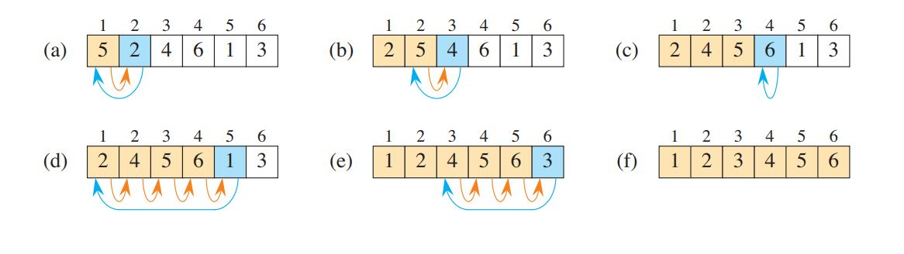

# Getting Started

## Insertion Sort

We use this algorithm to solve the sorting problem:  

**Math formula:** 

**Input:** A sequence of $n$ numbers $a_1, a_2, \ldots, a_n$.

**Output:** A permutation (reordering) $a'_1, a'_2, \ldots, a'_n$ of the input sequence such that  $a'_1 \le a'_2 \le \ldots \le a'_n$.

- The numbers to be sorted are also known as the **keys**.
- Other data which associated with keys, we call **satellite data**.
- Together, a key and satellite data form a **record**.

**For example:**
- Consider a spreadsheet containing student records with many associated pieces of data such as age, grade-point average, and number of courses taken.
- Any one of these quantities could be a key, but when the spreadsheet sorts, it moves the associated record (the satellite data) with the key.      

Insertion sort, which is an efficient algorithm for sorting a small number of elements. Remember always the card game, when we **insert** the cards on the right order place. this one called **Insertion Sort Algorithm**.

**To you find the correct position for a card, It's work like this:**
- By comparing the card with each of the cards already in your left hand.
- Starting at the right and moving left.
- As soon as you see a card in your left hand whose value is less than or equal to the card you're holding in your right hand.
- Insert the card that you're holding in your right hand just to the right of this card in your left hand.
- If all the cards in your left hand have values greater than the card in your right hand, then place this card as the leftmost card in your left hand.
- At all times, the cards held in your left hand are sorted, and these cards were originally the top cards of the pile on the table.     

---


**Implementaion of Insertion Sort Using C# Language :** 

```csharp
public static void InsertionSort(int[] arr)
{
    int arrayLength = arr.Length;
    for (int courrentIndex = 1; courrentIndex < arrayLength ; ++currentIndex)
    {
        int key = arr[courrentIndex];
        int sortedIndex = courrentIndex - 1;

        // Move elements of arr[0..courrentIndex -1], that are
        // greater than key, to one position ahead
        // of their current position
        while (sortedIndex >= 0 && arr[sortedIndex] > key)
        {
            arr[sortedIndex + 1] = arr[sortedIndex];
            sortedIndex--;
        }
        arr[sortedIndex + 1] = key;
    }
}
```

Let's break it down step by step:

### What is Insertion Sort?

- Insertion Sort is a simple sorting algorithm that builds the final sorted array (or list) one item at a time.

- It is much like sorting playing cards in your hands.

- The array is virtually split into a sorted and an unsorted part.

- Values from the unsorted part are picked and placed at the correct position in the sorted part.

### Code Explanation

#### Detailed Breakdown

1. **Method Definition:**
    ```csharp
    public static void InsertionSort(int[] arr)
    ```
    - This defines a public static method named `InsertionSort` that takes an array of integers (`int[] arr`) as a parameter.

2. **Initialize Length:**
    ```csharp
    int arrayLength = arr.Length;
    ```
    - Here, `arrayLength` is assigned the length of the array `arr`.

3. **Outer Loop:**
    ```csharp
    for (int currentIndex = 1; currentIndex < arrayLength ; ++currentIndex)
    ```
    - The outer loop runs from the second element (`currentIndex = 1`) to the last element (`currentIndex < arrayLength`).
    - This loop represents the boundary between the sorted and unsorted parts of the array.

4. **Key Element:**
    ```csharp
    int key = arr[currentIndex];
    int sortedIndex = currentIndex - 1;
    ```
    - `key` holds the current element to be inserted into the sorted portion of the array.
    - `sortedIndex` is initialized to the index of the last element in the sorted portion (`currentIndex - 1`).

5. **Inner Loop (Shifting Elements):**
    ```csharp
    while (sortedIndex >= 0 && arr[sortedIndex] > key)
    ```
    - The inner loop runs as long as `sortedIndex` is non-negative and the element at `arr[sortedIndex]` is greater than the `key`.
    - This loop shifts elements of the sorted portion that are greater than the `key` one position to the right to make space for the `key`.

    ```csharp
    arr[sortedIndex + 1] = arr[sortedIndex];
    sortedIndex--;
    ```
    - `arr[sortedIndex + 1] = arr[sortedIndex];` shifts the element at `arr[sortedIndex]` to the next position (`arr[sortedIndex + 1]`).
    - `sortedIndex--;` decrements `sortedIndex` to continue checking the next element to the left.

6. **Insert Key:**
    ```csharp
    arr[sortedIndex + 1] = key;
    ```
    - Once the correct position is found (when `arr[sortedIndex]` is not greater than `key` or `sortedIndex` is less than 0), `key` is placed at `arr[sortedIndex + 1]`.

### Example Walkthrough

Let's sort the array `[5, 2, 9, 1, 5, 6]` using the Insertion Sort algorithm:

1. **Initial Array:**
   ```
   [5, 2, 9, 1, 5, 6]
   ```

2. **First Iteration (`currentIndex = 1`):**
   - `key = 2`
   - Compare 2 with 5, shift 5 to the right.
   - Insert 2 at the beginning.
   ```
   [2, 5, 9, 1, 5, 6]
   ```

3. **Second Iteration (`currentIndex = 2`):**
   - `key = 9`
   - 9 is greater than 5, no shift needed.
   ```
   [2, 5, 9, 1, 5, 6]
   ```

4. **Third Iteration (`currentIndex = 3`):**
   - `key = 1`
   - Compare 1 with 9, 5, and 2, shift all to the right.
   - Insert 1 at the beginning.
   ```
   [1, 2, 5, 9, 5, 6]
   ```

5. **Fourth Iteration (`currentIndex = 4`):**
   - `key = 5`
   - Compare 5 with 9, shift 9 to the right.
   - Insert 5 before 9.
   ```
   [1, 2, 5, 5, 9, 6]
   ```

6. **Fifth Iteration (`currentIndex = 5`):**
   - `key = 6`
   - Compare 6 with 9, shift 9 to the right.
   - Insert 6 before 9.
   ```
   [1, 2, 5, 5, 6, 9]
   ```

Now the array is sorted:
```
[1, 2, 5, 5, 6, 9]
```

### Conclusion

 - The Insertion Sort algorithm works by iteratively taking one element from the unsorted portion and inserting it into its correct position in the sorted portion, shifting elements as necessary to make room.
 - This process results in a sorted array.

---
### Pseudocode for Insertion Sort Algorithm:

```pseudocode
INSERTION-SORT(A, n)
    for i = 1 to n
        key = A[i]
        // Insert A[i] into the sorted subarray A[1..i-1]
        j = i - 1
        while j > 0 and A[j] > key
            A[j+1] = A[j]
            j = j - 1
        A[j+1] = key

```

### A Figure to Shows How Inseartion Sort Algorithm Works:
---



### Detailed Explanation With Diagram

1. **Initial Array:**
    - The array starts as: `{5, 2, 4, 6, 1, 3}`, with `n = 6`.

2. **Iterations of the for loop:**

    **(a) First Iteration (`i = 1`):**
    - **Initial State:** `{5, 2, 4, 6, 1, 3}`
    - **Key:** `2` (blue rectangle)
    - **Comparison:** Compare `2` with `5`.
    - **Action:** Since `5` is greater than `2`, move `5` one position to the right.
    - **Result:** The array becomes `{2, 5, 4, 6, 1, 3}`. The key `2` is placed in the first position (indicated by the blue arrow).

    **(b) Second Iteration (`i = 2`):**
    - **Initial State:** `{2, 5, 4, 6, 1, 3}`
    - **Key:** `4` (blue rectangle)
    - **Comparison:** Compare `4` with `5`.
    - **Action:** Since `5` is greater than `4`, move `5` one position to the right.
    - **Result:** The array becomes `{2, 4, 5, 6, 1, 3}`. The key `4` is placed in the second position (indicated by the blue arrow).

    **(c) Third Iteration (`i = 3`):**
    - **Initial State:** `{2, 4, 5, 6, 1, 3}`
    - **Key:** `6` (blue rectangle)
    - **Comparison:** Compare `6` with `5`.
    - **Action:** Since `6` is already greater than `5`, no movement is needed.
    - **Result:** The array remains `{2, 4, 5, 6, 1, 3}`.

    **(d) Fourth Iteration (`i = 4`):**
    - **Initial State:** `{2, 4, 5, 6, 1, 3}`
    - **Key:** `1` (blue rectangle)
    - **Comparison:** Compare `1` with `6`, `5`, `4`, and `2`.
    - **Action:** Since `1` is smaller than all these values, shift all of them one position to the right.
    - **Result:** The array becomes `{1, 2, 4, 5, 6, 3}`. The key `1` is placed at the beginning (indicated by the blue arrow).

    **(e) Fifth Iteration (`i = 5`):**
    - **Initial State:** `{1, 2, 4, 5, 6, 3}`
    - **Key:** `3` (blue rectangle)
    - **Comparison:** Compare `3` with `6`, `5`, and `4`.
    - **Action:** Since `3` is smaller than `6`, `5`, and `4`, shift them one position to the right.
    - **Result:** The array becomes `{1, 2, 3, 4, 5, 6}`. The key `3` is placed in the third position (indicated by the blue arrow).

3. **Final Sorted Array:**
    - After completing all iterations, the final sorted array is `{1, 2, 3, 4, 5, 6}` (as shown in part (f) of the diagram).

### Summary
At each iteration of the for loop, the algorithm:
- Selects a key element from the unsorted portion.
- Compares the key with elements in the sorted portion.
- Shifts elements in the sorted portion to the right to make space for the key.
- Inserts the key into its correct position.
- This process continues until the entire array is sorted. 
- The diagram effectively illustrates the movement of elements and the insertion of the key at each step, making it clear how Insertion Sort operates.

---
- The notation `A[1:i-1]` is a common way to describe subarrays in programming and algorithm discussions.

### Understanding `A[1:i-1]`

1. **Array `A`**:
    - `A` is the name of the array.

2. **Subarray Notation `A[1:i-1]`**:
    - **Start Index (`1`)**: This indicates the starting position of the subarray.
    - **End Index (`i-1`)**: This indicates the ending position of the subarray.

### Reading `A[1:i-1]`

- The notation `A[1:i-1]` means the **portion of the array `A`** that starts at index `1` and ends at index `i-1`.

- In many programming languages, arrays are 0-indexed (i.e., the first element is `A[0]`), but in some contexts, especially in formal algorithm descriptions or mathematical contexts, arrays might be considered 1-indexed (i.e., the first element is `A[1]`).

### The notation `:`

 - The notation `:` denotes a subarray.
 - Thus,  `A[i:j]` indicates the subarray of A consisting of the elements `A[i], A[i+1], A[i+2], A[i+3], ...., A[j]`.
 - We also use this notation to indicate the bounds of an array `A[i:n]`.

### Usage in Loop Invariants

In the context of the Insertion Sort and the loop invariant:

- **Invariant:** The subarray `A[1:i-1]` is sorted.

- **Meaning:** This means that, at the start of each iteration of the loop, the elements from the first position up to the position `i-1` are in sorted order.

- **Example:**
    - If `i = 4`, then `A[1:i-1]` means `A[1:3]`.
    - This corresponds to the subarray `[2, 4, 5]` (assuming 1-based indexing).
    - The invariant states that `[2, 4, 5]` is sorted before the fourth iteration begins.

### Summary

- `A[1:i-1]` describes a subarray from index `1` to `i-1`.

- In a 0-indexed context, it would typically be `A[0:i-1]` to describe a subarray from the start up to (but not including) index `i`.

- In a 1-indexed context, `A[1:i-1]` describes a subarray from the first element up to (but not including) the `i`-th element.

- This notation is useful for describing specific parts of the array that are being operated on or considered in an algorithm.

Understanding this notation helps in grasping how algorithms manipulate subsets of the data structure to achieve their goals.

---


